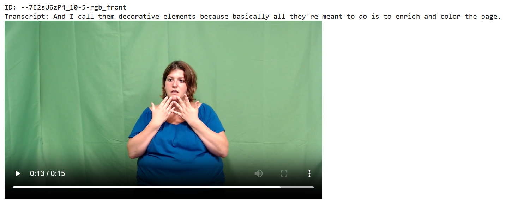

# Prepare How2Sign

The original How2Sign data is hosted on Google Drive, which has currently run out of Google download "quota", making access difficult.

This repository contains some preparation scripts for uploading structured front-view clips to HuggingFace.

Data sourced from [How2Sign](https://how2sign.github.io/).



# Instructions

Make sure you have your data sourced to a single folder

```
# data located in /mnt/c/Users/bence/Downloads/How2Sign

# translations and mappings
how2sign_test.csv
how2sign_val.csv
how2sign_train.csv

# all videos
test_rgb_front_clips/raw_videos
train_rgb_front_clips/raw_videos
val_rgb_front_clips/raw_videos
```

# Commands

```bash
# embed json metadata && create tar shards
python3 prepare.py
```


```bash
# upload to huggingface
huggingface-cli upload bdanko/how2sign /mnt/c/Users/bence/Downloads/How2Sign/hf_tar_shards --repo-type dataset
```